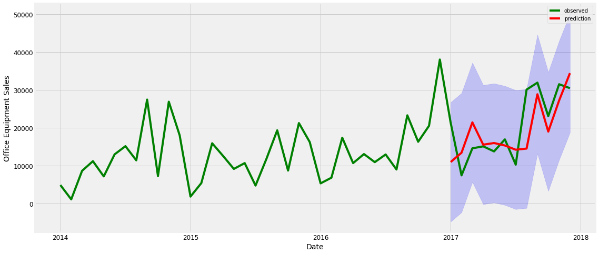
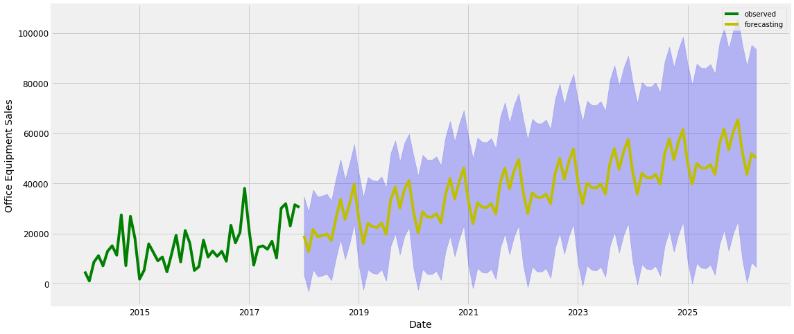

# Timeseries Analysys for Sales Data    
Refferences
- https://towardsdatascience.com/an-end-to-end-project-on-time-series-analysis-and-forecasting-with-python-4835e6bf050b
- https://www.kumilog.net/entry/sarima-pv
- https://logics-of-blue.com/python-time-series-analysis/


```python
# ライブラリのimport

import warnings
import itertools
import numpy as np
import matplotlib.pyplot as plt
warnings.filterwarnings("ignore")
plt.style.use('fivethirtyeight')

import pandas as pd
import matplotlib
matplotlib.rcParams['axes.labelsize'] = 14
matplotlib.rcParams['xtick.labelsize'] = 12
matplotlib.rcParams['ytick.labelsize'] = 12
matplotlib.rcParams['text.color'] = 'k'
```

## 1. Load Data


```python
# スーパーの売上データをimport

sales = pd.read_excel("Superstore.xls")
sales.head()
```


<div>
<style scoped>
    .dataframe tbody tr th:only-of-type {
        vertical-align: middle;
    }

    .dataframe tbody tr th {
        vertical-align: top;
    }

    .dataframe thead th {
        text-align: right;
    }
</style>
<table border="1" class="dataframe">
  <thead>
    <tr style="text-align: right;">
      <th></th>
      <th>Row ID</th>
      <th>Order ID</th>
      <th>Order Date</th>
      <th>Ship Date</th>
      <th>Ship Mode</th>
      <th>Customer ID</th>
      <th>Customer Name</th>
      <th>Segment</th>
      <th>Country</th>
      <th>City</th>
      <th>...</th>
      <th>Postal Code</th>
      <th>Region</th>
      <th>Product ID</th>
      <th>Category</th>
      <th>Sub-Category</th>
      <th>Product Name</th>
      <th>Sales</th>
      <th>Quantity</th>
      <th>Discount</th>
      <th>Profit</th>
    </tr>
  </thead>
  <tbody>
    <tr>
      <th>0</th>
      <td>1</td>
      <td>CA-2016-152156</td>
      <td>2016-11-08</td>
      <td>2016-11-11</td>
      <td>Second Class</td>
      <td>CG-12520</td>
      <td>Claire Gute</td>
      <td>Consumer</td>
      <td>United States</td>
      <td>Henderson</td>
      <td>...</td>
      <td>42420</td>
      <td>South</td>
      <td>FUR-BO-10001798</td>
      <td>Furniture</td>
      <td>Bookcases</td>
      <td>Bush Somerset Collection Bookcase</td>
      <td>261.9600</td>
      <td>2</td>
      <td>0.00</td>
      <td>41.9136</td>
    </tr>
    <tr>
      <th>1</th>
      <td>2</td>
      <td>CA-2016-152156</td>
      <td>2016-11-08</td>
      <td>2016-11-11</td>
      <td>Second Class</td>
      <td>CG-12520</td>
      <td>Claire Gute</td>
      <td>Consumer</td>
      <td>United States</td>
      <td>Henderson</td>
      <td>...</td>
      <td>42420</td>
      <td>South</td>
      <td>FUR-CH-10000454</td>
      <td>Furniture</td>
      <td>Chairs</td>
      <td>Hon Deluxe Fabric Upholstered Stacking Chairs,...</td>
      <td>731.9400</td>
      <td>3</td>
      <td>0.00</td>
      <td>219.5820</td>
    </tr>
    <tr>
      <th>2</th>
      <td>3</td>
      <td>CA-2016-138688</td>
      <td>2016-06-12</td>
      <td>2016-06-16</td>
      <td>Second Class</td>
      <td>DV-13045</td>
      <td>Darrin Van Huff</td>
      <td>Corporate</td>
      <td>United States</td>
      <td>Los Angeles</td>
      <td>...</td>
      <td>90036</td>
      <td>West</td>
      <td>OFF-LA-10000240</td>
      <td>Office Supplies</td>
      <td>Labels</td>
      <td>Self-Adhesive Address Labels for Typewriters b...</td>
      <td>14.6200</td>
      <td>2</td>
      <td>0.00</td>
      <td>6.8714</td>
    </tr>
    <tr>
      <th>3</th>
      <td>4</td>
      <td>US-2015-108966</td>
      <td>2015-10-11</td>
      <td>2015-10-18</td>
      <td>Standard Class</td>
      <td>SO-20335</td>
      <td>Sean O'Donnell</td>
      <td>Consumer</td>
      <td>United States</td>
      <td>Fort Lauderdale</td>
      <td>...</td>
      <td>33311</td>
      <td>South</td>
      <td>FUR-TA-10000577</td>
      <td>Furniture</td>
      <td>Tables</td>
      <td>Bretford CR4500 Series Slim Rectangular Table</td>
      <td>957.5775</td>
      <td>5</td>
      <td>0.45</td>
      <td>-383.0310</td>
    </tr>
    <tr>
      <th>4</th>
      <td>5</td>
      <td>US-2015-108966</td>
      <td>2015-10-11</td>
      <td>2015-10-18</td>
      <td>Standard Class</td>
      <td>SO-20335</td>
      <td>Sean O'Donnell</td>
      <td>Consumer</td>
      <td>United States</td>
      <td>Fort Lauderdale</td>
      <td>...</td>
      <td>33311</td>
      <td>South</td>
      <td>OFF-ST-10000760</td>
      <td>Office Supplies</td>
      <td>Storage</td>
      <td>Eldon Fold 'N Roll Cart System</td>
      <td>22.3680</td>
      <td>2</td>
      <td>0.20</td>
      <td>2.5164</td>
    </tr>
  </tbody>
</table>
<p>5 rows × 21 columns</p>
</div>


```python
sales.shape
```


    (9994, 21)


```python
# オフィス用品

sales.Category.value_counts()
```


    Office Supplies    6026
    Furniture          2121
    Technology         1847
    Name: Category, dtype: int64


```python
# オフィス用品の売上

office = sales.loc[sales.Category == "Office Supplies"]
office["Order Date"].min(), office["Order Date"].max()
```


    (Timestamp('2014-01-03 00:00:00'), Timestamp('2017-12-30 00:00:00'))


## 2. Preprocessing


```python
# 時間 - 目的変数だけのデータに

office = office[["Order Date", "Sales"]]
office.tail()
```


<div>
<style scoped>
    .dataframe tbody tr th:only-of-type {
        vertical-align: middle;
    }

    .dataframe tbody tr th {
        vertical-align: top;
    }

    .dataframe thead th {
        text-align: right;
    }
</style>
<table border="1" class="dataframe">
  <thead>
    <tr style="text-align: right;">
      <th></th>
      <th>Order Date</th>
      <th>Sales</th>
    </tr>
  </thead>
  <tbody>
    <tr>
      <th>9982</th>
      <td>2016-09-22</td>
      <td>35.56</td>
    </tr>
    <tr>
      <th>9984</th>
      <td>2015-05-17</td>
      <td>31.50</td>
    </tr>
    <tr>
      <th>9985</th>
      <td>2015-05-17</td>
      <td>55.60</td>
    </tr>
    <tr>
      <th>9992</th>
      <td>2017-02-26</td>
      <td>29.60</td>
    </tr>
    <tr>
      <th>9993</th>
      <td>2017-05-04</td>
      <td>243.16</td>
    </tr>
  </tbody>
</table>
</div>


```python
# 時間をユニークに

office = office.groupby("Order Date")["Sales"].mean().reset_index().set_index("Order Date")
```


```python
office.head()
```


<div>
<style scoped>
    .dataframe tbody tr th:only-of-type {
        vertical-align: middle;
    }

    .dataframe tbody tr th {
        vertical-align: top;
    }

    .dataframe thead th {
        text-align: right;
    }
</style>
<table border="1" class="dataframe">
  <thead>
    <tr style="text-align: right;">
      <th></th>
      <th>Sales</th>
    </tr>
    <tr>
      <th>Order Date</th>
      <th></th>
    </tr>
  </thead>
  <tbody>
    <tr>
      <th>2014-01-03</th>
      <td>16.448</td>
    </tr>
    <tr>
      <th>2014-01-04</th>
      <td>288.060</td>
    </tr>
    <tr>
      <th>2014-01-05</th>
      <td>19.536</td>
    </tr>
    <tr>
      <th>2014-01-06</th>
      <td>685.340</td>
    </tr>
    <tr>
      <th>2014-01-07</th>
      <td>10.430</td>
    </tr>
  </tbody>
</table>
</div>


```python
print(office.shape)
office.index
```

    (1148, 1)


    DatetimeIndex(['2014-01-03', '2014-01-04', '2014-01-05', '2014-01-06',
                   '2014-01-07', '2014-01-09', '2014-01-10', '2014-01-13',
                   '2014-01-16', '2014-01-18',
                   ...
                   '2017-12-21', '2017-12-22', '2017-12-23', '2017-12-24',
                   '2017-12-25', '2017-12-26', '2017-12-27', '2017-12-28',
                   '2017-12-29', '2017-12-30'],
                  dtype='datetime64[ns]', name='Order Date', length=1148, freq=None)


```python
office.columns
```


    Index(['Sales'], dtype='object')


```python
# pandasで時系列データをリサンプリングするresample, asfreq
# https://note.nkmk.me/python-pandas-time-series-resample-asfreq/
# 月間合計販売商品数

office["Sales"].resample("MS").sum()
```


    Order Date
    2014-01-01     4851.080
    2014-02-01     1071.724
    2014-03-01     8605.879
    2014-04-01    11155.074
    2014-05-01     7135.624
    2014-06-01    12953.037
    2014-07-01    15121.208
    2014-08-01    11379.462
    2014-09-01    27423.298
    2014-10-01     7211.128
    2014-11-01    26862.436
    2014-12-01    18006.462
    2015-01-01     1808.780
    2015-02-01     5368.067
    2015-03-01    15882.547
    2015-04-01    12558.558
    2015-05-01     9113.736
    2015-06-01    10647.747
    2015-07-01     4719.939
    2015-08-01    11735.108
    2015-09-01    19305.767
    2015-10-01     8673.410
    2015-11-01    21218.130
    2015-12-01    16201.674
    2016-01-01     5299.682
    2016-02-01     6794.350
    2016-03-01    17346.931
    2016-04-01    10647.447
    2016-05-01    13035.202
    2016-06-01    10901.810
    2016-07-01    12924.444
    2016-08-01     8959.740
    2016-09-01    23263.738
    2016-10-01    16281.794
    2016-11-01    20487.278
    2016-12-01    37997.566
    2017-01-01    21274.289
    2017-02-01     7407.772
    2017-03-01    14550.286
    2017-04-01    15072.191
    2017-05-01    13736.964
    2017-06-01    16912.039
    2017-07-01    10241.468
    2017-08-01    30059.852
    2017-09-01    31895.843
    2017-10-01    23037.192
    2017-11-01    31472.337
    2017-12-01    30436.942
    Freq: MS, Name: Sales, dtype: float64


```python
qua = office["Sales"].resample("MS").sum()
qua["2016":]
```


    Order Date
    2016-01-01     5299.682
    2016-02-01     6794.350
    2016-03-01    17346.931
    2016-04-01    10647.447
    2016-05-01    13035.202
    2016-06-01    10901.810
    2016-07-01    12924.444
    2016-08-01     8959.740
    2016-09-01    23263.738
    2016-10-01    16281.794
    2016-11-01    20487.278
    2016-12-01    37997.566
    2017-01-01    21274.289
    2017-02-01     7407.772
    2017-03-01    14550.286
    2017-04-01    15072.191
    2017-05-01    13736.964
    2017-06-01    16912.039
    2017-07-01    10241.468
    2017-08-01    30059.852
    2017-09-01    31895.843
    2017-10-01    23037.192
    2017-11-01    31472.337
    2017-12-01    30436.942
    Freq: MS, Name: Sales, dtype: float64


## 3. Visualization


```python
# 月ごとの推移

from cycler import cycler
matplotlib.rcParams['axes.prop_cycle'] = cycler(color='g')
qua.plot(figsize=(14, 8))
plt.show()
```


```python
# sm.tsa
import statsmodels.api as sm

from pylab import rcParams
rcParams['figure.figsize'] = 17, 8

# 季節調整モデル, freq には周期を入力
# 観測データ(生データ)、トレンド成分、季節成分、残差
# 観測データ(生データ) = トレンド成分 + 季節成分 + 残差 が成立
dec = sm.tsa.seasonal_decompose(qua)
dec.plot()
plt.show()
```


```python
# seasonal_decompose() のプロパティで各値が参照可能
# 季節調整済みデータ

print(dec.seasonal.head())
dec.seasonal.plot()
```

    Order Date
    2014-01-01   -4743.916612
    2014-02-01   -7873.112973
    2014-03-01    1208.510152
    2014-04-01   -2240.604307
    2014-05-01   -3321.868487
    Freq: MS, Name: Sales, dtype: float64


    <matplotlib.axes._subplots.AxesSubplot at 0x1c1db0da20>


```python
# トレンドデータ

dec.trend.plot()
```


    <matplotlib.axes._subplots.AxesSubplot at 0x1c1bdccd68>


## 4. Autocorrelation and Stationarity
- 自己回帰性と定常性（定常対数処理）


```python
# 自己相関係数
acf = sm.tsa.stattools.acf(qua, nlags=40)
acf
```


    array([ 1.        ,  0.3465952 ,  0.17756702,  0.28049578,  0.02595144,
           -0.06035751,  0.0215513 , -0.11102946,  0.03945658,  0.1570095 ,
           -0.00541671,  0.18605849,  0.41010425,  0.12664661,  0.00194821,
            0.05026981, -0.05181487, -0.09290225, -0.03157313, -0.16114175,
           -0.11263851, -0.0139181 , -0.11864444, -0.11286058,  0.18046005,
            0.08472129, -0.06821096,  0.01596359, -0.08794383, -0.09989902,
           -0.08183489, -0.21641838, -0.18196523, -0.04531745, -0.20649073,
           -0.07394005,  0.11249027,  0.05203674,  0.02005478,  0.00107143,
           -0.07124018])


```python
# 偏自己相関

pacf = sm.tsa.stattools.pacf(qua, nlags=40)
print(pacf)
```

    [ 1.00000000e+00  3.53969562e-01  6.85863602e-02  2.45615086e-01
     -1.83279820e-01 -8.14306452e-02  1.85284755e-02 -1.14775074e-01
      2.19672568e-01  1.42799918e-01 -9.44644844e-02  2.44071356e-01
      4.11292895e-01 -1.28030344e-01 -3.40380299e-01 -1.20945019e-01
      1.08226001e-01 -2.53859603e-02  6.17865608e-02 -2.63918321e-01
     -3.52668297e-01  1.44559329e-02  1.22068667e-01 -4.53066743e-01
      5.44170492e-01  7.57797842e-01 -2.09651885e+00 -2.72354102e-01
     -1.37820151e+00 -8.91726195e-01  1.33425340e+00 -8.38340443e-01
      2.91576853e+01  9.40188478e-01 -1.06667541e+00 -2.63995178e-02
     -1.23647163e+00  2.40077833e+00  5.93328682e-01  8.01138737e-01
      4.84088400e-01]


```python
# 可視化

fig, (ax1, ax2) = plt.subplots(nrows=2, sharex=True)
sm.graphics.tsa.plot_acf(qua, lags=40, ax=ax1)
sm.graphics.tsa.plot_pacf(qua, lags=40, ax=ax2)
```


```python
# 定常性
# ほとんどの時系列分析の手法では、データが定常性（平均と分散が一定）であることを前提にしている
# 定常性は拡張Dickey-Fuller検定(ADF検定)で調べることができる

adf = sm.tsa.stattools.adfuller(qua)
adf
```


    (-1.9054805932813965,
     0.32948727549472834,
     2,
     45,
     {'1%': -3.584828853223594,
      '5%': -2.9282991495198907,
      '10%': -2.6023438271604937},
     769.7596865314149)


```python
# p < 0.05となり、有意水準5%で帰無仮説（定常性を持つ）が棄却され、このデータは定常性を持つと言える

print('p-value = {:.4}'.format(adf[1]))
```

    p-value = 0.3295


- https://www.kumilog.net/entry/sarima-pv

## 5. Time series forecasting with ARMA, ARIMA, SARIMA

### 5-1. ARIMA

- seasonality, trend, noise


```python
# 季節調整、トレンド、ノイズを考慮

s = t = n = range(0, 2)
stn = list(itertools.product(s, t, n))
stn
```


    [(0, 0, 0),
     (0, 0, 1),
     (0, 1, 0),
     (0, 1, 1),
     (1, 0, 0),
     (1, 0, 1),
     (1, 1, 0),
     (1, 1, 1)]


```python
seasonal_stn = [(x[0], x[1], x[2], 12) for x in list(itertools.product(s, t, n))]
seasonal_stn
```


    [(0, 0, 0, 12),
     (0, 0, 1, 12),
     (0, 1, 0, 12),
     (0, 1, 1, 12),
     (1, 0, 0, 12),
     (1, 0, 1, 12),
     (1, 1, 0, 12),
     (1, 1, 1, 12)]


### AIC for ARIMA model


```python
# Gridサーチのように最適なARIMAパラメーターを探す

aic = []

for param in stn:
    for param_seasonal in seasonal_stn:
        try:
            ARIMA = sm.tsa.statespace.SARIMAX(
                qua,
                order=param,
                seasonal_order=param_seasonal,
                enforce_stationarity=False,
                enforce_invertibility=False)
            
            results = ARIMA.fit()
            aic.append(results.aic)
            print('ARIMA{}x{}12 - AIC:{}'.format(param, param_seasonal, results.aic))
            
        
        except:
            continue
```

    ARIMA(0, 0, 0)x(0, 0, 0, 12)12 - AIC:1053.0434572094705
    ARIMA(0, 0, 0)x(0, 0, 1, 12)12 - AIC:1533.290490270095
    ARIMA(0, 0, 0)x(0, 1, 0, 12)12 - AIC:726.9951257238105
    ARIMA(0, 0, 0)x(1, 0, 0, 12)12 - AIC:747.9440618711935


    /Users/akr712/.pyenv/versions/anaconda3-5.3.1/lib/python3.7/site-packages/statsmodels/base/model.py:508: ConvergenceWarning: Maximum Likelihood optimization failed to converge. Check mle_retvals
      "Check mle_retvals", ConvergenceWarning)
    /Users/akr712/.pyenv/versions/anaconda3-5.3.1/lib/python3.7/site-packages/statsmodels/base/model.py:508: ConvergenceWarning: Maximum Likelihood optimization failed to converge. Check mle_retvals
      "Check mle_retvals", ConvergenceWarning)


    ARIMA(0, 0, 0)x(1, 0, 1, 12)12 - AIC:1639.1452450606535
    ARIMA(0, 0, 0)x(1, 1, 0, 12)12 - AIC:505.4154278070372
    ARIMA(0, 0, 1)x(0, 0, 0, 12)12 - AIC:1011.5696864702725
    ARIMA(0, 0, 1)x(0, 0, 1, 12)12 - AIC:5467.333613996261
    ARIMA(0, 0, 1)x(0, 1, 0, 12)12 - AIC:707.1669946394741
    ARIMA(0, 0, 1)x(1, 0, 0, 12)12 - AIC:782.0746550513683
    ARIMA(0, 0, 1)x(1, 0, 1, 12)12 - AIC:4706.950291473884
    ARIMA(0, 0, 1)x(1, 1, 0, 12)12 - AIC:503.9741923843367
    ARIMA(0, 1, 0)x(0, 0, 0, 12)12 - AIC:974.8831462780947


    /Users/akr712/.pyenv/versions/anaconda3-5.3.1/lib/python3.7/site-packages/statsmodels/base/model.py:508: ConvergenceWarning: Maximum Likelihood optimization failed to converge. Check mle_retvals
      "Check mle_retvals", ConvergenceWarning)


    ARIMA(0, 1, 0)x(0, 0, 1, 12)12 - AIC:1575.909833840187
    ARIMA(0, 1, 0)x(0, 1, 0, 12)12 - AIC:719.7155379651105
    ARIMA(0, 1, 0)x(1, 0, 0, 12)12 - AIC:728.8363067930317


    /Users/akr712/.pyenv/versions/anaconda3-5.3.1/lib/python3.7/site-packages/statsmodels/base/model.py:508: ConvergenceWarning: Maximum Likelihood optimization failed to converge. Check mle_retvals
      "Check mle_retvals", ConvergenceWarning)


    ARIMA(0, 1, 0)x(1, 0, 1, 12)12 - AIC:1342.052277088058
    ARIMA(0, 1, 0)x(1, 1, 0, 12)12 - AIC:486.7929479474992
    ARIMA(0, 1, 1)x(0, 0, 0, 12)12 - AIC:940.3819651382298
    ARIMA(0, 1, 1)x(0, 0, 1, 12)12 - AIC:4065.388799855644
    ARIMA(0, 1, 1)x(0, 1, 0, 12)12 - AIC:688.133778485485
    ARIMA(0, 1, 1)x(1, 0, 0, 12)12 - AIC:723.3336241079471
    ARIMA(0, 1, 1)x(1, 0, 1, 12)12 - AIC:3859.7944476418174
    ARIMA(0, 1, 1)x(1, 1, 0, 12)12 - AIC:479.27805449502887
    ARIMA(1, 0, 0)x(0, 0, 0, 12)12 - AIC:994.8552444803465
    ARIMA(1, 0, 0)x(0, 0, 1, 12)12 - AIC:4269.260282651181
    ARIMA(1, 0, 0)x(0, 1, 0, 12)12 - AIC:726.4956825553602
    ARIMA(1, 0, 0)x(1, 0, 0, 12)12 - AIC:730.6466405241263


    /Users/akr712/.pyenv/versions/anaconda3-5.3.1/lib/python3.7/site-packages/statsmodels/base/model.py:508: ConvergenceWarning: Maximum Likelihood optimization failed to converge. Check mle_retvals
      "Check mle_retvals", ConvergenceWarning)


    ARIMA(1, 0, 0)x(1, 0, 1, 12)12 - AIC:1363.044189194775
    ARIMA(1, 0, 0)x(1, 1, 0, 12)12 - AIC:482.41756661162145
    ARIMA(1, 0, 1)x(0, 0, 0, 12)12 - AIC:959.3240241771649
    ARIMA(1, 0, 1)x(0, 0, 1, 12)12 - AIC:2361103642.830115
    ARIMA(1, 0, 1)x(0, 1, 0, 12)12 - AIC:706.2407959230522
    ARIMA(1, 0, 1)x(1, 0, 0, 12)12 - AIC:724.2543375671826
    ARIMA(1, 0, 1)x(1, 0, 1, 12)12 - AIC:9456997.483329289
    ARIMA(1, 0, 1)x(1, 1, 0, 12)12 - AIC:480.3070901587738
    ARIMA(1, 1, 0)x(0, 0, 0, 12)12 - AIC:968.1458060325821
    ARIMA(1, 1, 0)x(0, 0, 1, 12)12 - AIC:3717.971724650394
    ARIMA(1, 1, 0)x(0, 1, 0, 12)12 - AIC:711.4286459347915
    ARIMA(1, 1, 0)x(1, 0, 0, 12)12 - AIC:707.4415972983965


    /Users/akr712/.pyenv/versions/anaconda3-5.3.1/lib/python3.7/site-packages/statsmodels/base/model.py:508: ConvergenceWarning: Maximum Likelihood optimization failed to converge. Check mle_retvals
      "Check mle_retvals", ConvergenceWarning)


    ARIMA(1, 1, 0)x(1, 0, 1, 12)12 - AIC:1139.2095858358039
    ARIMA(1, 1, 0)x(1, 1, 0, 12)12 - AIC:464.2301087073786
    ARIMA(1, 1, 1)x(0, 0, 0, 12)12 - AIC:942.0196001404285
    ARIMA(1, 1, 1)x(0, 0, 1, 12)12 - AIC:3918.394972165385
    ARIMA(1, 1, 1)x(0, 1, 0, 12)12 - AIC:689.6684110369828
    ARIMA(1, 1, 1)x(1, 0, 0, 12)12 - AIC:704.5190016509324
    ARIMA(1, 1, 1)x(1, 0, 1, 12)12 - AIC:3053.1860471368664
    ARIMA(1, 1, 1)x(1, 1, 0, 12)12 - AIC:460.86141074854


```python
# 赤池情報量規準：ＡＩＣ
# 「実世界をよく表す真のモデルを見つけよう」とするのではなく、「よく予測できるモデルを作ろう」と考えた
# 観測データの数が限られている時は、無理に真のモデル（実世界をよく表したモデル）を選ぶよりも、もっと単純なモデルのほうが、予測精度が高まる
# aicが最小 = もっともよく”予測”できるモデル

min(aic)
```


    460.86141074854


```python
# 状態空間モデルにARIMAを

ARIMA = sm.tsa.statespace.SARIMAX(qua,
                                  order=(1, 1, 1),
                                  seasonal_order=(1, 1, 0, 12),
                                  enforce_stationarity=False,
                                  enforce_invertibility=False)

res = ARIMA.fit()
print(res.summary().tables[1])
```

    ==============================================================================
                     coef    std err          z      P>|z|      [0.025      0.975]
    ------------------------------------------------------------------------------
    ar.L1          0.1389      0.283      0.491      0.624      -0.416       0.694
    ma.L1         -0.9740      0.270     -3.603      0.000      -1.504      -0.444
    ar.S.L12      -0.4655      0.496     -0.939      0.348      -1.438       0.507
    sigma2      6.343e+07   3.84e-09   1.65e+16      0.000    6.34e+07    6.34e+07
    ==============================================================================


```python
# 可視化する
# 標準残差

res.plot_diagnostics()
plt.show()
```


```python
print(res.summary().tables[0])
```

                                     Statespace Model Results                                 
    ==========================================================================================
    Dep. Variable:                              Sales   No. Observations:                   48
    Model:             SARIMAX(1, 1, 1)x(1, 1, 0, 12)   Log Likelihood                -226.431
    Date:                            Sun, 29 Sep 2019   AIC                            460.861
    Time:                                    14:09:49   BIC                            465.226
    Sample:                                01-01-2014   HQIC                           461.889
                                         - 12-01-2017                                         
    Covariance Type:                              opg                                         
    ==========================================================================================


```python
res.summary().tables
```


    [<class 'statsmodels.iolib.table.SimpleTable'>,
     <class 'statsmodels.iolib.table.SimpleTable'>,
     <class 'statsmodels.iolib.table.SimpleTable'>]


## 6. Validation


```python
# 2017年以降の月間平均売上を予測
# ARIMA.get_prediction()で予測できる

pred = res.get_prediction(start=pd.to_datetime("2017-01-01"), dynamic=False)
pred
```


    <statsmodels.tsa.statespace.mlemodel.PredictionResultsWrapper at 0x1c1e08b630>


```python
pred_ci = pred.conf_int()
pred_ci
```


<div>
<style scoped>
    .dataframe tbody tr th:only-of-type {
        vertical-align: middle;
    }

    .dataframe tbody tr th {
        vertical-align: top;
    }

    .dataframe thead th {
        text-align: right;
    }
</style>
<table border="1" class="dataframe">
  <thead>
    <tr style="text-align: right;">
      <th></th>
      <th>lower Sales</th>
      <th>upper Sales</th>
    </tr>
    <tr>
      <th>Order Date</th>
      <th></th>
      <th></th>
    </tr>
  </thead>
  <tbody>
    <tr>
      <th>2017-01-01</th>
      <td>-4820.939079</td>
      <td>26698.896931</td>
    </tr>
    <tr>
      <th>2017-02-01</th>
      <td>-2360.634163</td>
      <td>29138.405184</td>
    </tr>
    <tr>
      <th>2017-03-01</th>
      <td>5658.401850</td>
      <td>37138.417968</td>
    </tr>
    <tr>
      <th>2017-04-01</th>
      <td>-220.369036</td>
      <td>31242.202931</td>
    </tr>
    <tr>
      <th>2017-05-01</th>
      <td>226.762723</td>
      <td>31673.302193</td>
    </tr>
    <tr>
      <th>2017-06-01</th>
      <td>-420.573862</td>
      <td>31011.199765</td>
    </tr>
    <tr>
      <th>2017-07-01</th>
      <td>-1528.881155</td>
      <td>29889.267064</td>
    </tr>
    <tr>
      <th>2017-08-01</th>
      <td>-1220.039548</td>
      <td>30185.513317</td>
    </tr>
    <tr>
      <th>2017-09-01</th>
      <td>13133.051143</td>
      <td>44526.941750</td>
    </tr>
    <tr>
      <th>2017-10-01</th>
      <td>3274.008968</td>
      <td>34657.084898</td>
    </tr>
    <tr>
      <th>2017-11-01</th>
      <td>11489.312937</td>
      <td>42862.346059</td>
    </tr>
    <tr>
      <th>2017-12-01</th>
      <td>18718.509136</td>
      <td>50082.204043</td>
    </tr>
  </tbody>
</table>
</div>


```python
# 観測値
ax = qua["2014":].plot(label="observed")

# 平均回帰
pred.predicted_mean.plot(ax=ax, label="prediction", color='r')

# 最大値と最小値の塗りつぶし
ax.fill_between(pred_ci.index,
                pred_ci.iloc[:, 0],
                pred_ci.iloc[:, 1], color='b', alpha=.2)

ax.set_xlabel('Date')
ax.set_ylabel('Office Equipment Sales')
plt.legend()
plt.show()
```





・二乗平均誤差（MSE：Mean Squared Error）
　誤差の絶対値を平均したもの

・二乗平均平方根誤差（RMSE：Root Mean Squared Error）
　誤差の二乗を平均して平方根をとったもの


```python
# MSE = 二乗平均誤差 誤差の面積

forcasting = pred.predicted_mean
truth = qua['2017-01-01':]
mse = ((forcasting - truth) ** 2).mean()
mse
```


    42958293.33024817


```python
# RMSE = 二乗平均平方根誤差

rmse = np.sqrt(mse)
rmse
```


    6554.257649058982


```python
# 観測された月間平均売上の最小値と最大値

qua.min(), qua.max()
```


    (1071.724, 37997.565999999984)


## 7. Prediction


```python


pred_uc = res.get_forecast(steps=100)
pred_ci = pred_uc.conf_int()
ax = y.plot(label='observed', figsize=(14, 7))
pred_uc.predicted_mean.plot(ax=ax, label='Forecast')
ax.fill_between(pred_ci.index,
                pred_ci.iloc[:, 0],
                pred_ci.iloc[:, 1], color='k', alpha=.25)
ax.set_xlabel('Date')
ax.set_ylabel('Furniture Sales')
plt.legend()
plt.show()
```


    ---------------------------------------------------------------------------

    NameError                                 Traceback (most recent call last)

    <ipython-input-189-d3aafcb3c323> in <module>()
          1 pred_uc = results.get_forecast(steps=100)
          2 pred_ci = pred_uc.conf_int()
    ----> 3 ax = y.plot(label='observed', figsize=(14, 7))
          4 pred_uc.predicted_mean.plot(ax=ax, label='Forecast')
          5 ax.fill_between(pred_ci.index,


    NameError: name 'y' is not defined


```python
# 予測モデル
# ARIMA.fit().get_forcast()で予測

forecasting = res.get_forecast(steps=100)
pred_ci = forecasting.conf_int()
ax = qua.plot(label='observed')

# 平均回帰線
forecasting.predicted_mean.plot(label='forecasting', ax=ax, color='y')

# 予測の最小値と最大値
ax.fill_between(pred_ci.index,
                pred_ci.iloc[:, 0],
                pred_ci.iloc[:, 1], color='b', alpha=.25)

ax.set_xlabel('Date')
ax.set_ylabel('Office Equipment Sales')
plt.legend()
plt.show()
```





- finish!
